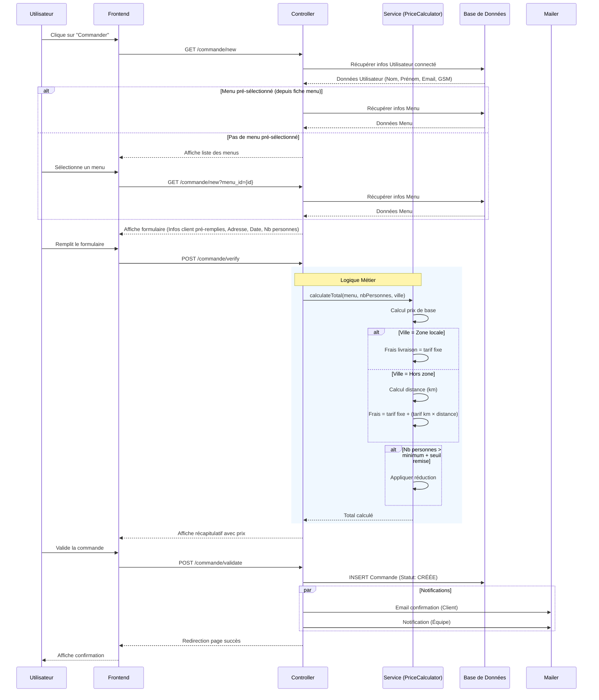

## Diagramme de séquence : Commande

Un utilisateur connecté commande un menu : 

```mermaid
sequenceDiagram
    participant U as Utilisateur
    participant F as Frontend
    participant C as Controller
    participant S as Service (PriceCalculator)
    participant DB as Base de Données
    participant M as Mailer

    %% Étape 1 : Initiation de la commande
    U->>F: Clique sur "Commander"
    F->>C: GET /commande/new

    C->>DB: Récupérer infos Utilisateur connecté
    DB-->>C: Données Utilisateur (Nom, Prénom, Email, GSM)

    alt Menu pré-sélectionné (depuis fiche menu)
        C->>DB: Récupérer infos Menu
        DB-->>C: Données Menu
    else Pas de menu pré-sélectionné
        C-->>F: Affiche liste des menus
        U->>F: Sélectionne un menu
        F->>C: GET /commande/new?menu_id={id}
        C->>DB: Récupérer infos Menu
        DB-->>C: Données Menu
    end

    C-->>F: Affiche formulaire (Infos client pré-remplies, Adresse, Date, Nb personnes)

    %% Étape 2 : Saisie & Calculs
    U->>F: Remplit le formulaire
    F->>C: POST /commande/verify

    rect rgb(240, 248, 255)
        Note over C,S: Logique Métier
        C->>S: calculateTotal(menu, nbPersonnes, ville)
        S->>S: Calcul prix de base
        
        alt Ville = Zone locale
            S->>S: Frais livraison = tarif fixe
        else Ville = Hors zone
            S->>S: Calcul distance (km)
            S->>S: Frais = tarif fixe + (tarif km × distance)
        end

        alt Nb personnes > minimum + seuil remise
            S->>S: Appliquer réduction
        end

        S-->>C: Total calculé
    end

    C-->>F: Affiche récapitulatif avec prix

    %% Étape 3 : Validation
    U->>F: Valide la commande
    F->>C: POST /commande/validate

    C->>DB: INSERT Commande (Statut: CRÉÉE)

    par Notifications
        C->>M: Email confirmation (Client)
        C->>M: Notification (Équipe)
    end

    C-->>F: Redirection page succès
    F-->>U: Affiche confirmation
```