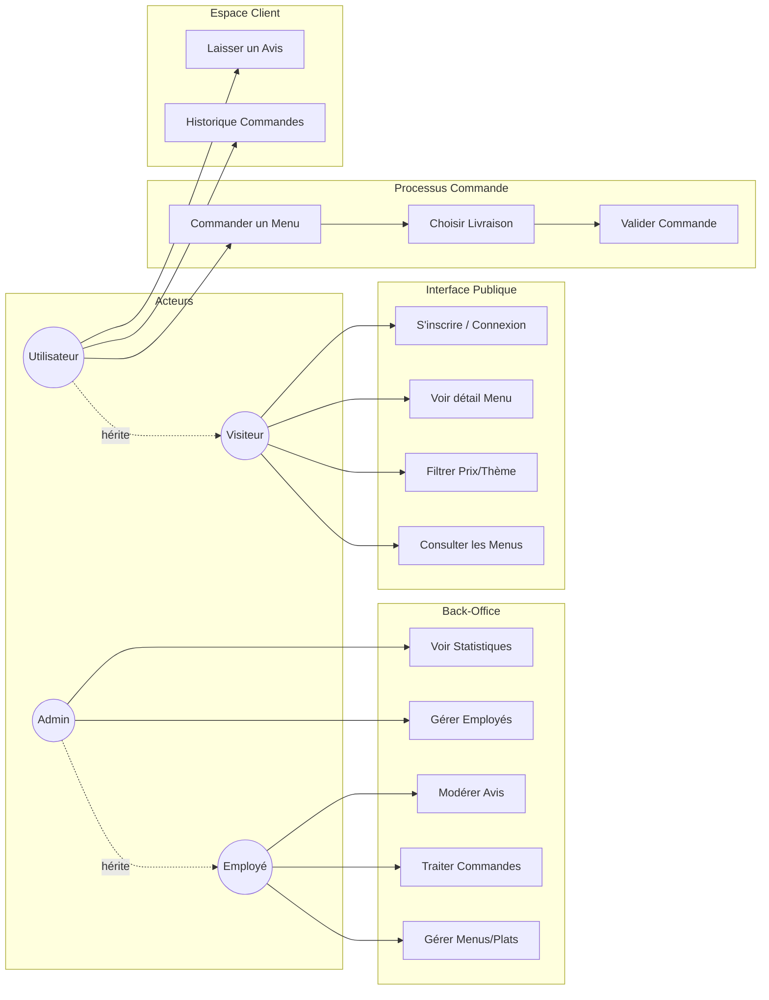

## Diagramme de cas d'utilisation - Qui fait quoi

```mermaid
flowchart LR
    subgraph Acteurs
        V((Visiteur))
        U((Utilisateur))
        E((Employé))
        A((Admin))
    end

    subgraph Interface_Publique["Interface Publique"]
        UC1[Consulter les Menus]
        UC2[Filtrer Prix/Thème]
        UC3[Voir détail Menu]
        UC4[S'inscrire / Connexion]
    end

    subgraph Processus_Commande["Processus Commande"]
        UC5[Commander un Menu]
        UC6[Choisir Livraison]
        UC7[Valider Commande]
    end

    subgraph Espace_Client["Espace Client"]
        UC8[Historique Commandes]
        UC9[Laisser un Avis]
    end

    subgraph Back_Office["Back-Office"]
        UC10[Gérer Menus/Plats]
        UC11[Traiter Commandes]
        UC12[Modérer Avis]
        UC13[Gérer Employés]
        UC14[Voir Statistiques]
    end

    %% Visiteur
    V --> UC1 & UC2 & UC3 & UC4

    %% Utilisateur hérite de Visiteur + ses propres cas
    U -.->|hérite| V
    U --> UC5 & UC8 & UC9
    UC5 --> UC6 --> UC7

    %% Employé
    E --> UC10 & UC11 & UC12

    %% Admin hérite de Employé + ses propres cas
    A -.->|hérite| E
    A --> UC13 & UC14
```